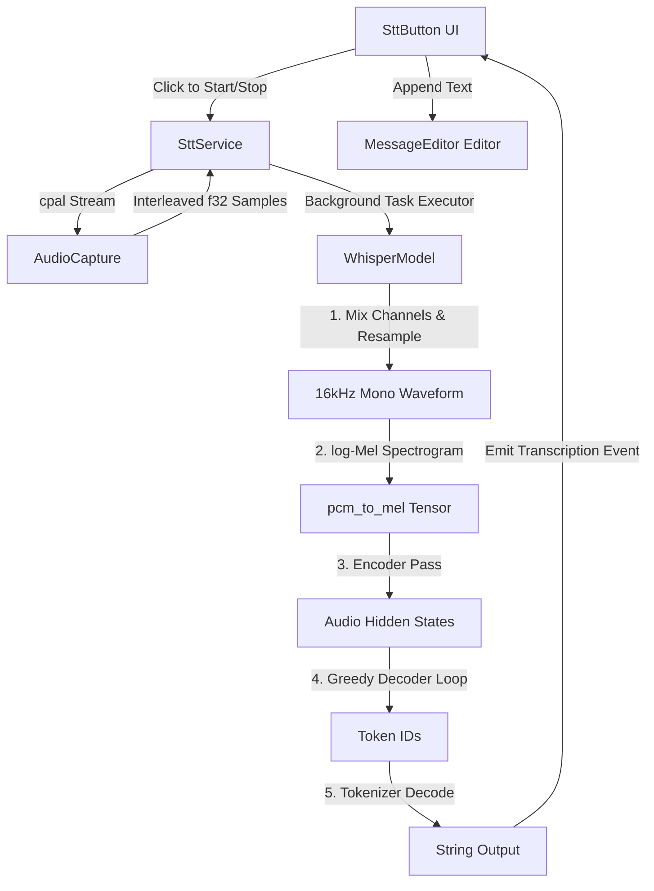

# Local Speech-To-Text (STT) ML Pipeline Documentation

This document describes the offline Speech-to-Text (STT) inference pipeline integrated into Nir (Zed). It details the architecture, file layout, preprocessing steps, and concurrency execution model to prevent editor UI thread freezes.

---

## 1. Architecture Overview



---

## 2. Files Involved

### Backend Crate: `prompt_stt`
This crate isolates all audio recording, downsampling, and tensor operations from the core editor.

* **[Cargo.toml](file:///c:/Users/bansa/OneDrive/Desktop/zed/zed/crates/prompt_stt/Cargo.toml)**
  * Manages ML dependencies (`candle-core`, `candle-transformers`, and `tokenizers`) and audio dependencies (`cpal`).
* **[src/lib.rs](file:///c:/Users/bansa/OneDrive/Desktop/zed/zed/crates/prompt_stt/src/lib.rs)**
  * Defines [SttService](file:///c:/Users/bansa/OneDrive/Desktop/zed/zed/crates/prompt_stt/src/lib.rs#L10), the orchestration service wrapping audio recording and inference logic.
* **[src/audio_capture.rs](file:///c:/Users/bansa/OneDrive/Desktop/zed/zed/crates/prompt_stt/src/audio_capture.rs)**
  * Implements [AudioCapture](file:///c:/Users/bansa/OneDrive/Desktop/zed/zed/crates/prompt_stt/src/audio_capture.rs#L5), managing the `cpal` hardware recording stream.
  * Tracks and exposes `sample_rate` and `channels` from the default microphone configuration.
* **[src/whisper.rs](file:///c:/Users/bansa/OneDrive/Desktop/zed/zed/crates/prompt_stt/src/whisper.rs)**
  * Implements [WhisperModel](file:///c:/Users/bansa/OneDrive/Desktop/zed/zed/crates/prompt_stt/src/whisper.rs#L9), which manages download caching, tensor computation, and token decoding.

### Frontend UI Crate: `agent_ui`
This crate manages the UI visual states and text-editor insertion events.

* **[src/stt_button.rs](file:///c:/Users/bansa/OneDrive/Desktop/zed/zed/crates/agent_ui/src/stt_button.rs)**
  * Implements the [SttButton](file:///c:/Users/bansa/OneDrive/Desktop/zed/zed/crates/agent_ui/src/stt_button.rs#L15) GPUI component (the mic icon).
* **[src/message_editor.rs](file:///c:/Users/bansa/OneDrive/Desktop/zed/zed/crates/agent_ui/src/message_editor.rs)**
  * Places the `SttButton` next to the prompt text box and handles the insertion of `SttEvent::Transcription(text)` at the cursor.

---

## 3. Preprocessing: Resampling & Mixing

OpenAI's Whisper model requires exactly **16,000 Hz mono** float audio input. Hardware devices often capture audio in stereo (2 channels) at 44.1kHz or 48kHz.

The `resample_to_16k` function handles this transformation locally and efficiently:
1. **Mono Mixing**: Interleaved multi-channel samples are averaged:
   $$\text{sample}_{\text{mono}} = \frac{\sum_{i=1}^{c} \text{channel}_i}{c}$$
2. **Linear Interpolation Downsampling**: Audio is rescaled to 16kHz using linear fraction weights:
   $$x_t = x_{\lfloor t \rfloor} \cdot (1 - \text{frac}) + x_{\lfloor t \rfloor + 1} \cdot \text{frac}$$

---

## 4. Inference & Greedy Decoding

1. **Log-Mel Spectrogram**: The processed 16kHz audio slice is converted to a spectrogram using Whisper's standard Mel filterbank (loaded from `melfilters.bytes`):
   * Executed via `candle_transformers::models::whisper::audio::pcm_to_mel`.
2. **Encoder Forward**: Runs `model.encoder.forward(&mel, true)` to extract audio features.
3. **Autoregressive Greedy Decoding**:
   * Initializes sequence with special tokens: `[SOT_TOKEN, TRANSCRIBE_TOKEN, NO_TIMESTAMPS_TOKEN]`.
   * For each step (up to 100 max), runs the decoder:
     `model.decoder.forward(&tokens, &audio_features, true)`
   * Squeezes and narrows the outputs to get the last sequence index logits, and samples greedily via argmax:
     $$\text{next\_token} = \arg\max(\text{logits})$$
   * Breaks early if `EOT_TOKEN` is generated, and decodes the final token IDs using `tokenizer.decode()`.

---

## 5. Concurrency Execution Model (Anti-UI-Freeze)

In GPUI, the standard `cx.spawn(...)` runs on the local foreground UI thread. If heavy computations (like Whisper's forward passes) run directly in `cx.spawn`, the editor freezes.

To keep the UI perfectly smooth, we spawn the transcription on GPUI's thread pool via **`background_executor()`** and cooperatively await it:

```rust
self._task = Some(cx.spawn(async move |this, cx| {
    let service_arc_clone = service_arc.clone();
    
    // 1. Offload heavy computation to background thread pool
    let result = cx.background_executor().spawn(async move {
        let mut service = service_arc_clone.lock().await;
        service.stop_listening()
    }).await; // cooperative await yields UI thread control

    // 2. Resume on UI thread to update component state
    let _ = gpui::AsyncApp::update(cx, |cx| {
        this.update(cx, |this: &mut SttButton, cx| {
            match result {
                Ok(text) => cx.emit(SttEvent::Transcription(text)),
                Err(e) => cx.emit(SttEvent::Error(e.to_string())),
            }
            this.is_listening = false;
            cx.notify();
        }).ok()
    });
}));
```

---

## 6. Corrupted File Recovery & Isolation

* **Isolated Tokio Runtime**: GPUI's background executor is not a standard Tokio thread pool. Network downloads in `whisper.rs` are spawned on a separate OS thread (`std::thread::spawn`) running its own `tokio::runtime::Builder` to prevent DNS reactor panics.
* **Corrupted File Cleanup**: On boot, any downloaded file in the model path under 100 bytes (e.g. HuggingFace "Entry not found" HTTP responses) is automatically removed to trigger a clean re-download.
